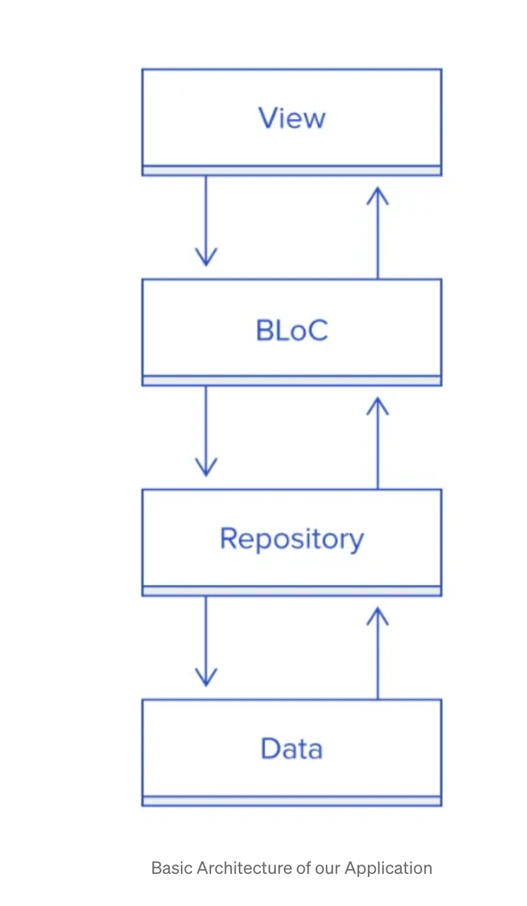

# shiok_jobs_flutter

Flutter project for SJ Job Application

## Architecture Software Design Pattern
Following best practice to use Bloc and Repository. Referencing to this  [article.](https://medium.com/flutter-community/handling-network-calls-like-a-pro-in-flutter-31bd30c86be1)

